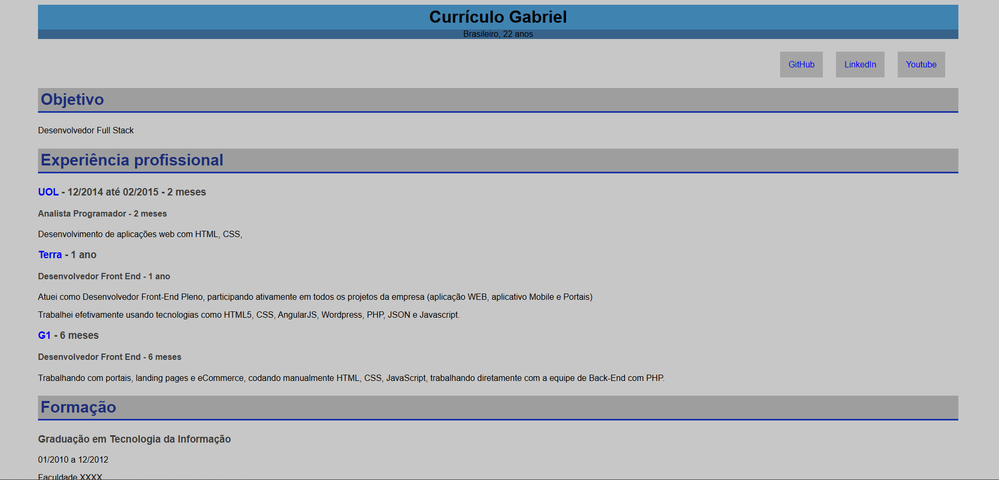

# Projeto de currículo
## Tecnologias usadas: HTML e CSS
#### obs: todas as informações do site são fictícias

## Foto do projeto1:

## Foto do projeto2:
### Adição de um menu no canto superior direito

